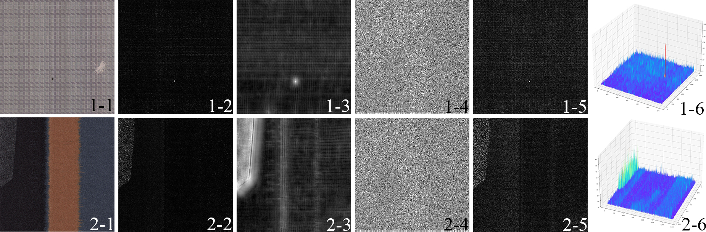

# Fabric defect detection based on 3-D feature
This work uses a novel method to solve the problem of fabric defect detection.
## Method overview
Mainstream fabric defect detection algorithms like local feature extraction combined with gray-level co-occurrence matrix (MDBP/GLCM), Gabor filtering combined with principal component analysis (PCA), image decomposition (ID) method, Elo-Rating method and template correction (TC) method are often confronted with the problem of poor detection of small and inconspicuous defects. The reason is that they often focused on 2D features of the defects. Such as edge, frequency, local binary and shape.
Instand of follow the traditional ways, we use 3D feature, namely, volume feature, to locate defects.

fig 1: Different features of two types of defects.
In order to get the volume feature of defects, we use clustering method. Then volumn filtering is proformed to seperate niose and defects.
In order to achieve an efficient and adaptive defect clustering algorithm, a new clustering evaluation index (DEVI) is defined.
## Usage
First make sure that the environment opencv2 is installed and configured.
Please modify the storage address of the image on lines 21, 22 and 107 in the file main.cpp.
## Results
Can be seen in [res](https://github.com/HRW1/Fabric-defect-detection-based-on-3-D-feature/tree/main/res).

Image x_n.jpg is the result of x.jpg in [data_tc](https://github.com/HRW1/Fabric-defect-detection-based-on-3-D-feature/tree/main/data_tc). For example: 2_1.jpg is the result of 2.jpg in data_tc.
## Contect
E-mail: hrwen@mail.dhu.edu.cn
